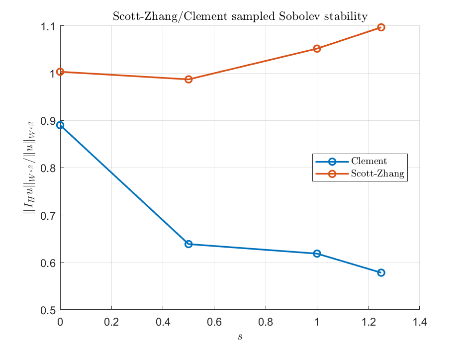

## Clement And Scott-Zhang Transfers

Approximation proxy uses `||u-I_Hu||_{L^p}/(H||u||_{W^{1,2}})` and a max local patch proxy.

Summary of maximum ratios over all displayed 2D rows:

| family | Clement max | Scott-Zhang max |
|---|---:|---:|
| approximation global ratio | 5.8175e-01 | 5.0539e-01 |
| approximation local ratio | 6.2774e-01 | 2.4713e-01 |
| sampled/full stability ratio | 1.0000e+00 | 1.1403e+00 |

| operator | H | p | global ratio | max local ratio |
|---|---:|---:|---:|---:|
| Clement | 0.5 | 1 | 1.3900e-01 | 2.1221e-01 |
| Clement | 0.5 | 2 | 1.6598e-01 | 2.1221e-01 |
| Clement | 0.5 | 4 | 2.0033e-01 | 2.1221e-01 |
| Clement | 0.5 | 8 | 2.3916e-01 | 2.1221e-01 |
| Clement | 0.5 | inf | 3.5588e-01 | 2.1221e-01 |
| Scott-Zhang | 0.5 | 1 | 1.0488e-01 | 2.4713e-01 |
| Scott-Zhang | 0.5 | 2 | 1.4740e-01 | 2.4713e-01 |
| Scott-Zhang | 0.5 | 4 | 2.1609e-01 | 2.4713e-01 |
| Scott-Zhang | 0.5 | 8 | 3.0415e-01 | 2.4713e-01 |
| Scott-Zhang | 0.5 | inf | 5.0539e-01 | 2.4713e-01 |
| Clement | 0.25 | 1 | 1.6257e-01 | 6.2774e-01 |
| Clement | 0.25 | 2 | 1.9754e-01 | 6.2774e-01 |
| Clement | 0.25 | 4 | 2.4715e-01 | 6.2774e-01 |
| Clement | 0.25 | 8 | 3.0694e-01 | 6.2774e-01 |
| Clement | 0.25 | inf | 4.9837e-01 | 6.2774e-01 |
| Scott-Zhang | 0.25 | 1 | 6.0601e-02 | 2.0821e-01 |
| Scott-Zhang | 0.25 | 2 | 7.7767e-02 | 2.0821e-01 |
| Scott-Zhang | 0.25 | 4 | 1.0526e-01 | 2.0821e-01 |
| Scott-Zhang | 0.25 | 8 | 1.5295e-01 | 2.0821e-01 |
| Scott-Zhang | 0.25 | inf | 2.8942e-01 | 2.0821e-01 |
| Clement | 0.125 | 1 | 1.2034e-01 | 5.4925e-01 |
| Clement | 0.125 | 2 | 1.5422e-01 | 5.4925e-01 |
| Clement | 0.125 | 4 | 2.1237e-01 | 5.4925e-01 |
| Clement | 0.125 | 8 | 3.0358e-01 | 5.4925e-01 |
| Clement | 0.125 | inf | 5.8175e-01 | 5.4925e-01 |
| Scott-Zhang | 0.125 | 1 | 2.8314e-02 | 1.7678e-01 |
| Scott-Zhang | 0.125 | 2 | 3.5631e-02 | 1.7678e-01 |
| Scott-Zhang | 0.125 | 4 | 4.6830e-02 | 1.7678e-01 |
| Scott-Zhang | 0.125 | 8 | 6.7819e-02 | 1.7678e-01 |
| Scott-Zhang | 0.125 | inf | 1.5205e-01 | 1.7678e-01 |

Sampled Sobolev stability ratios for 2D P1 transfers. Fractional `s` values are diagnostics based on quadrature/centroid samples.

| operator | H | s | p | ratio | sampled? |
|---|---:|---:|---:|---:|---|
| Clement | 0.5 | 0 | 1 | 1.0000e+00 | no |
| Clement | 0.5 | 0 | 2 | 8.2343e-01 | no |
| Clement | 0.5 | 0 | 4 | 7.0329e-01 | no |
| Clement | 0.5 | 0 | 8 | 6.3771e-01 | no |
| Clement | 0.5 | 0 | inf | 5.8549e-01 | no |
| Clement | 0.5 | 0.5 | 1 | 3.1674e-01 | yes |
| Clement | 0.5 | 0.5 | 2 | 3.6516e-01 | yes |
| Clement | 0.5 | 0.5 | 4 | 3.8653e-01 | yes |
| Clement | 0.5 | 0.5 | 8 | 3.9356e-01 | yes |
| Clement | 0.5 | 0.5 | inf | 3.5318e-01 | yes |
| Clement | 0.5 | 1 | 1 | 4.2910e-01 | no |
| Clement | 0.5 | 1 | 2 | 3.4213e-01 | no |
| Clement | 0.5 | 1 | 4 | 2.9330e-01 | no |
| Clement | 0.5 | 1 | 8 | 2.7257e-01 | no |
| Clement | 0.5 | 1 | inf | 2.5079e-01 | no |
| Clement | 0.5 | 1.25 | 1 | 2.1954e-01 | yes |
| Clement | 0.5 | 1.25 | 2 | 2.4488e-01 | yes |
| Clement | 0.5 | 1.25 | 4 | 2.5760e-01 | yes |
| Clement | 0.5 | 1.25 | 8 | 2.6945e-01 | yes |
| Clement | 0.5 | 1.25 | inf | 2.5889e-01 | yes |
| Scott-Zhang | 0.5 | 0 | 1 | 8.2488e-01 | no |
| Scott-Zhang | 0.5 | 0 | 2 | 9.1773e-01 | no |
| Scott-Zhang | 0.5 | 0 | 4 | 9.8206e-01 | no |
| Scott-Zhang | 0.5 | 0 | 8 | 1.0430e+00 | no |
| Scott-Zhang | 0.5 | 0 | inf | 1.0130e+00 | no |
| Scott-Zhang | 0.5 | 0.5 | 1 | 7.3492e-01 | yes |
| Scott-Zhang | 0.5 | 0.5 | 2 | 9.8994e-01 | yes |
| Scott-Zhang | 0.5 | 0.5 | 4 | 1.0941e+00 | yes |
| Scott-Zhang | 0.5 | 0.5 | 8 | 1.1263e+00 | yes |
| Scott-Zhang | 0.5 | 0.5 | inf | 9.9548e-01 | yes |
| Scott-Zhang | 0.5 | 1 | 1 | 9.5886e-01 | no |
| Scott-Zhang | 0.5 | 1 | 2 | 1.0365e+00 | no |
| Scott-Zhang | 0.5 | 1 | 4 | 1.0197e+00 | no |
| Scott-Zhang | 0.5 | 1 | 8 | 9.7104e-01 | no |
| Scott-Zhang | 0.5 | 1 | inf | 8.5219e-01 | no |
| Scott-Zhang | 0.5 | 1.25 | 1 | 9.2788e-01 | yes |
| Scott-Zhang | 0.5 | 1.25 | 2 | 1.0706e+00 | yes |
| Scott-Zhang | 0.5 | 1.25 | 4 | 1.0947e+00 | yes |
| Scott-Zhang | 0.5 | 1.25 | 8 | 1.0966e+00 | yes |
| Scott-Zhang | 0.5 | 1.25 | inf | 1.0456e+00 | yes |
| Clement | 0.25 | 0 | 1 | 1.0000e+00 | no |
| Clement | 0.25 | 0 | 2 | 8.9009e-01 | no |
| Clement | 0.25 | 0 | 4 | 8.2674e-01 | no |
| Clement | 0.25 | 0 | 8 | 8.0145e-01 | no |
| Clement | 0.25 | 0 | inf | 7.8535e-01 | no |
| Clement | 0.25 | 0.5 | 1 | 5.8049e-01 | yes |
| Clement | 0.25 | 0.5 | 2 | 6.3870e-01 | yes |
| Clement | 0.25 | 0.5 | 4 | 6.4359e-01 | yes |
| Clement | 0.25 | 0.5 | 8 | 6.3981e-01 | yes |
| Clement | 0.25 | 0.5 | inf | 6.0498e-01 | yes |
| Clement | 0.25 | 1 | 1 | 6.8055e-01 | no |
| Clement | 0.25 | 1 | 2 | 6.1859e-01 | no |
| Clement | 0.25 | 1 | 4 | 5.8031e-01 | no |
| Clement | 0.25 | 1 | 8 | 5.4820e-01 | no |
| Clement | 0.25 | 1 | inf | 4.8105e-01 | no |
| Clement | 0.25 | 1.25 | 1 | 5.1274e-01 | yes |
| Clement | 0.25 | 1.25 | 2 | 5.7826e-01 | yes |
| Clement | 0.25 | 1.25 | 4 | 6.0195e-01 | yes |
| Clement | 0.25 | 1.25 | 8 | 6.1818e-01 | yes |
| Clement | 0.25 | 1.25 | inf | 6.5024e-01 | yes |
| Scott-Zhang | 0.25 | 0 | 1 | 1.0062e+00 | no |
| Scott-Zhang | 0.25 | 0 | 2 | 1.0030e+00 | no |
| Scott-Zhang | 0.25 | 0 | 4 | 9.9542e-01 | no |
| Scott-Zhang | 0.25 | 0 | 8 | 9.8992e-01 | no |
| Scott-Zhang | 0.25 | 0 | inf | 9.8807e-01 | no |
| Scott-Zhang | 0.25 | 0.5 | 1 | 8.6746e-01 | yes |
| Scott-Zhang | 0.25 | 0.5 | 2 | 9.8685e-01 | yes |
| Scott-Zhang | 0.25 | 0.5 | 4 | 1.0145e+00 | yes |
| Scott-Zhang | 0.25 | 0.5 | 8 | 1.0240e+00 | yes |
| Scott-Zhang | 0.25 | 0.5 | inf | 1.0434e+00 | yes |
| Scott-Zhang | 0.25 | 1 | 1 | 1.0298e+00 | no |
| Scott-Zhang | 0.25 | 1 | 2 | 1.0519e+00 | no |
| Scott-Zhang | 0.25 | 1 | 4 | 1.0597e+00 | no |
| Scott-Zhang | 0.25 | 1 | 8 | 1.0491e+00 | no |
| Scott-Zhang | 0.25 | 1 | inf | 9.8924e-01 | no |
| Scott-Zhang | 0.25 | 1.25 | 1 | 9.4920e-01 | yes |
| Scott-Zhang | 0.25 | 1.25 | 2 | 1.0969e+00 | yes |
| Scott-Zhang | 0.25 | 1.25 | 4 | 1.1403e+00 | yes |
| Scott-Zhang | 0.25 | 1.25 | 8 | 1.1375e+00 | yes |
| Scott-Zhang | 0.25 | 1.25 | inf | 1.0303e+00 | yes |
| Clement | 0.125 | 0 | 1 | 1.0000e+00 | no |
| Clement | 0.125 | 0 | 2 | 9.5836e-01 | no |
| Clement | 0.125 | 0 | 4 | 9.4462e-01 | no |
| Clement | 0.125 | 0 | 8 | 9.4190e-01 | no |
| Clement | 0.125 | 0 | inf | 9.5059e-01 | no |
| Clement | 0.125 | 0.5 | 1 | 8.8501e-01 | yes |
| Clement | 0.125 | 0.5 | 2 | 8.7850e-01 | yes |
| Clement | 0.125 | 0.5 | 4 | 8.9866e-01 | yes |
| Clement | 0.125 | 0.5 | 8 | 8.9590e-01 | yes |
| Clement | 0.125 | 0.5 | inf | 7.4221e-01 | yes |
| Clement | 0.125 | 1 | 1 | 8.5134e-01 | no |
| Clement | 0.125 | 1 | 2 | 8.2496e-01 | no |
| Clement | 0.125 | 1 | 4 | 8.0242e-01 | no |
| Clement | 0.125 | 1 | 8 | 7.6757e-01 | no |
| Clement | 0.125 | 1 | inf | 7.0380e-01 | no |
| Clement | 0.125 | 1.25 | 1 | 8.3399e-01 | yes |
| Clement | 0.125 | 1.25 | 2 | 8.6142e-01 | yes |
| Clement | 0.125 | 1.25 | 4 | 8.5566e-01 | yes |
| Clement | 0.125 | 1.25 | 8 | 8.5440e-01 | yes |
| Clement | 0.125 | 1.25 | inf | 8.5644e-01 | yes |
| Scott-Zhang | 0.125 | 0 | 1 | 1.0050e+00 | no |
| Scott-Zhang | 0.125 | 0 | 2 | 1.0040e+00 | no |
| Scott-Zhang | 0.125 | 0 | 4 | 1.0031e+00 | no |
| Scott-Zhang | 0.125 | 0 | 8 | 1.0028e+00 | no |
| Scott-Zhang | 0.125 | 0 | inf | 1.0141e+00 | no |
| Scott-Zhang | 0.125 | 0.5 | 1 | 1.0287e+00 | yes |
| Scott-Zhang | 0.125 | 0.5 | 2 | 1.0121e+00 | yes |
| Scott-Zhang | 0.125 | 0.5 | 4 | 1.0249e+00 | yes |
| Scott-Zhang | 0.125 | 0.5 | 8 | 1.0273e+00 | yes |
| Scott-Zhang | 0.125 | 0.5 | inf | 9.4467e-01 | yes |
| Scott-Zhang | 0.125 | 1 | 1 | 1.0147e+00 | no |
| Scott-Zhang | 0.125 | 1 | 2 | 1.0179e+00 | no |
| Scott-Zhang | 0.125 | 1 | 4 | 1.0186e+00 | no |
| Scott-Zhang | 0.125 | 1 | 8 | 1.0131e+00 | no |
| Scott-Zhang | 0.125 | 1 | inf | 9.7329e-01 | no |
| Scott-Zhang | 0.125 | 1.25 | 1 | 1.0190e+00 | yes |
| Scott-Zhang | 0.125 | 1.25 | 2 | 1.0583e+00 | yes |
| Scott-Zhang | 0.125 | 1.25 | 4 | 1.0461e+00 | yes |
| Scott-Zhang | 0.125 | 1.25 | 8 | 1.0284e+00 | yes |
| Scott-Zhang | 0.125 | 1.25 | inf | 1.0069e+00 | yes |

3D pilot stability ratios:

| operator | s | p | ratio |
|---|---:|---:|---:|
| Clement | 0 | 2 | 7.6773e-01 |
| Clement | 0 | inf | 4.7601e-01 |
| Clement | 1 | 2 | 3.2410e-01 |
| Clement | 1 | inf | 2.2985e-01 |
| Scott-Zhang | 0 | 2 | 7.5477e-01 |
| Scott-Zhang | 0 | inf | 9.4954e-01 |
| Scott-Zhang | 1 | 2 | 9.4862e-01 |
| Scott-Zhang | 1 | inf | 9.7118e-01 |