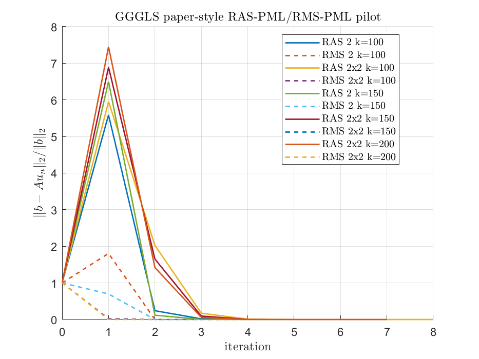
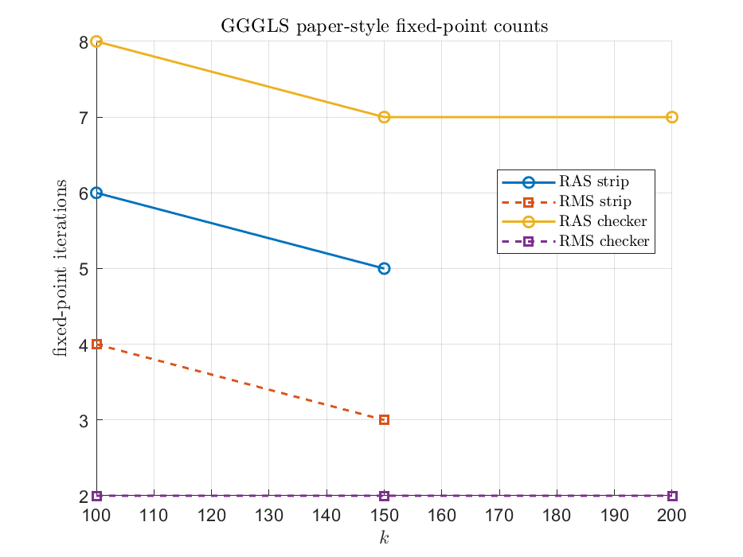

Reproduction target: GGGLS24 Section 8.3 RAS-PML/RMS-PML iteration counts for Helmholtz.
Created: 2026-05-24
Updated: 2026-05-25
Verification entry point: `verify/verify_gggls_ras_pml_reproduce.m`
Main utilities: `assembleGGGLSPML2D`, `assembleHelmholtzPML2D`, `partitionMesh2D`, `orasHelmholtz`

# GGGLS RAS-PML/RMS-PML Reproduction Pilot

## Verification Entry Point

Run the reproduction pilot with:

```bash
matlab -nosplash -nodesktop -batch "addpath(genpath('.')); run('verify/verify_gggls_ras_pml_reproduce.m');"
```

The entry-point script is `verify/verify_gggls_ras_pml_reproduce.m`.

This report uses a separate non-divergence assembly for the GGGLS form
`a(u,v)=int k^{-2}((D grad u).grad v - (beta.grad u)v)-u v`, with `f_PML(x)=5000*x^3/3`, `delta=kappa=1/40`, and P2 elements.

The mesh divisor is rounded up to a multiple of `40`, and of the requested subdomain grid sizes, so that the global boundary, physical/PML interfaces, overlap interfaces, and local PML boundaries are resolved by mesh edges as assumed in the GGGLS discrete setup.





| shape | grid | k | 1/h | DOF | RAS fixed | RAS GMRES | RMS fixed | RAS relres | GMRES true relres | GMRES prec relres | RMS relres | status |
|---|---:|---:|---:|---:|---:|---:|---:|---:|---:|---:|---:|---|
| strip | 2 | 100 | 320 | 450241 | 6 | 5 | 4 | 8.597e-07 | 6.184e-06 | 6.103e-07 | 5.989e-09 | ok |
| checker | 2x2 | 100 | 320 | 450241 | 8 | 6 | 2 | 4.107e-07 | 8.120e-06 | 5.850e-07 | 6.910e-08 | ok |
| strip | 2 | 150 | 560 | 1380625 | 5 | 4 | 3 | 5.505e-08 | 5.727e-06 | 1.891e-07 | 7.431e-09 | ok |
| checker | 2x2 | 150 | 560 | 1380625 | 7 | 6 | 2 | 1.650e-07 | 4.507e-07 | 2.577e-08 | 1.933e-10 | ok |
| strip | 2 | 200 | 760 | 2550409 | skip | skip | skip | NaN | NaN | NaN | NaN | skip-memory-est-122.8GB |
| checker | 2x2 | 200 | 760 | 2544025 | 7 | 5 | 2 | 2.732e-08 | 6.029e-06 | 3.016e-07 | 2.030e-11 | ok |

Paper Section 8.3 uses `k=100:50:350`, strips `N=2,4,8`, and checkerboards `2x2,4x4,8x8`. This script defaults to the smallest paper point and skips any requested case whose memory estimate exceeds `GGGLS_MEMORY_GB`.

Target Case 1 counts from GGGLS Tables 1-4:

- RAS strips: `N=2`: 6,4,4,4,4,4 fixed-point counts for k=100..350; GMRES counts are the bracketed values.
- RMS strips: `N=2`: 4,3,2,2,2,2 fixed-point counts.
- RAS checkerboard `2x2`: 8,7,7,6,6,6 fixed-point counts.
- RMS checkerboard `2x2`: 2 fixed-point counts across k=100..350.

## Direct comparison for the requested cases

| shape | grid | k | paper RAS fixed | measured RAS fixed | paper GMRES | measured GMRES | paper RMS fixed | measured RMS fixed | note |
|---|---:|---:|---:|---:|---:|---:|---:|---:|---|
| strip | 2 | 100 | 6 | 6 | 6 | 5 | 4 | 4 | ok |
| checker | 2x2 | 100 | 8 | 8 | 7 | 6 | 2 | 2 | ok |
| strip | 2 | 150 | 4 | 5 | 4 | 4 | 3 | 3 | ok |
| checker | 2x2 | 150 | 7 | 7 | 6 | 6 | 2 | 2 | ok |
| strip | 2 | 200 | 4 | skip | 4 | skip | 2 | skip | skip-memory-est-122.8GB |
| checker | 2x2 | 200 | 7 | 7 | 6 | 5 | 2 | 2 | ok |

Here `measured GMRES` is the iteration count for the explicitly preconditioned GGGLS system `B_h^{-1}A_h x=B_h^{-1}b`, matching the GMRES system described in the paper. The measured table above also reports the unpreconditioned physical residual `||b-Ax||/||b||`, which can be slightly larger at the same iteration.
