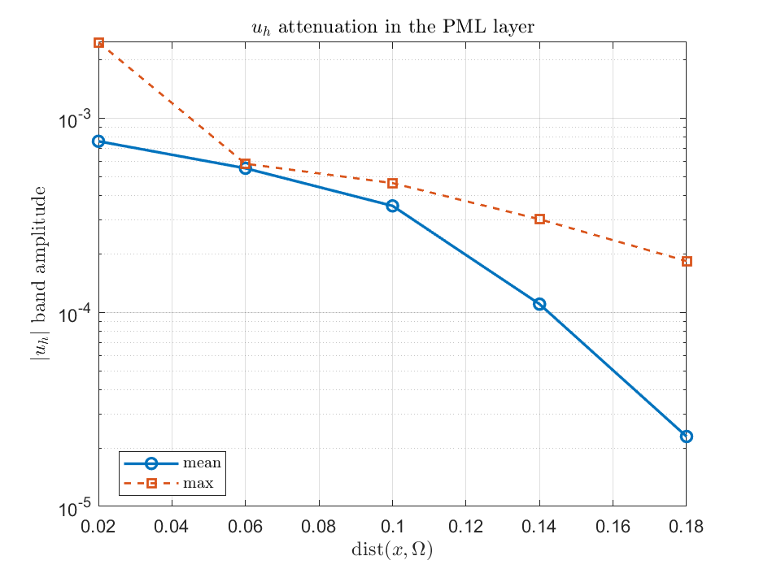
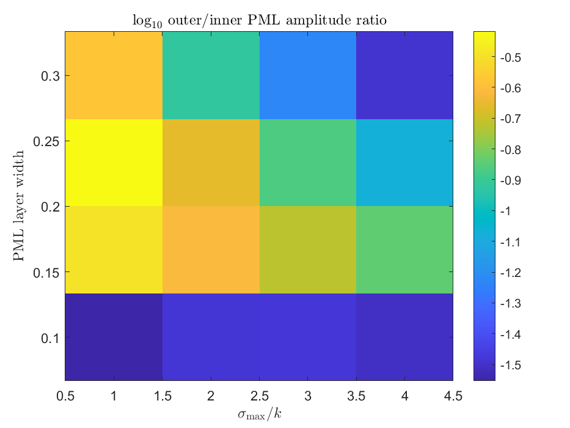
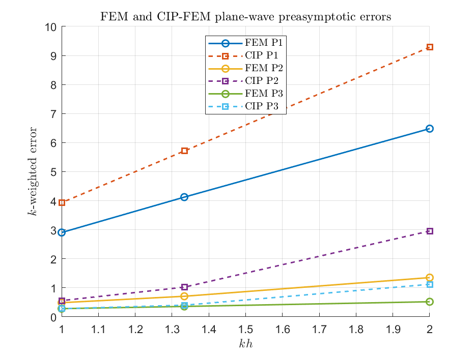

verification target: theory-level checks for CIP formulation
Created: 2026-05-24
Updated: 2026-05-25
Verification entry point: `verify/verify_theory_new_functions.m`
Main utilities: `assembleHelmholtzPML2D`, `assembleNondivStiffness2D`, `assembleCIP2D`, `normalDerivativeJump2D`

# Theory-Level Verification Results

## PML Decay And Convergence

PML decay: `k=20`, `h=0.04`, layer width `0.2`, outer/inner mean-amplitude ratio `4.157e-02`.

Definition of band center: let `d(x)=dist(x,Omega_phys)` and split the PML layer `[0,width]` into radial-distance bands `[r_i,r_{i+1}]`. The reported band center is `(r_i+r_{i+1})/2`; the mean/max amplitudes are computed over mesh nodes whose distance `d(x)` lies in that band. Thus the table measures whether `|u_h|` decays as one moves outward through the PML layer.

| band center | mean amplitude | max amplitude |
|---:|---:|---:|
| 0.02 | 7.5895e-04 | 2.4547e-03 |
| 0.06 | 5.5111e-04 | 5.8158e-04 |
| 0.1 | 3.5285e-04 | 4.6224e-04 |
| 0.14 | 1.1007e-04 | 3.0098e-04 |
| 0.18 | 2.2909e-05 | 1.8334e-04 |

PML layer width and complex absorption sweep: `sigmaMax` is the peak value in `s_l=1+i*sigma_l/k`, so `sigmaMax/k` is the largest imaginary stretch in one coordinate direction. Smaller outer/inner ratios mean stronger attenuation from the inner third to the outer third of the layer.

| width | sigmaMax/k | sigmaMax | inner mean | outer mean | outer/inner | outer max | DOF |
|---:|---:|---:|---:|---:|---:|---:|---:|
| 0.1 | 1 | 20 | 8.2589e-04 | 2.3088e-05 | 2.7955e-02 | 6.0862e-04 | 529 |
| 0.1 | 2 | 40 | 6.6266e-04 | 2.1911e-05 | 3.3065e-02 | 5.1823e-04 | 529 |
| 0.1 | 3 | 60 | 6.1451e-04 | 2.0496e-05 | 3.3353e-02 | 4.6334e-04 | 529 |
| 0.1 | 4 | 80 | 6.0437e-04 | 1.8753e-05 | 3.1028e-02 | 4.2904e-04 | 529 |
| 0.15 | 1 | 20 | 5.6694e-04 | 1.8159e-04 | 3.2029e-01 | 6.3066e-04 | 625 |
| 0.15 | 2 | 40 | 5.5331e-04 | 1.3529e-04 | 2.4452e-01 | 4.0925e-04 | 625 |
| 0.15 | 3 | 60 | 5.5174e-04 | 1.0415e-04 | 1.8877e-01 | 3.3646e-04 | 625 |
| 0.15 | 4 | 80 | 5.4929e-04 | 7.9741e-05 | 1.4517e-01 | 2.7937e-04 | 625 |
| 0.2 | 1 | 20 | 5.2936e-04 | 2.0154e-04 | 3.8073e-01 | 6.1811e-04 | 729 |
| 0.2 | 2 | 40 | 5.4846e-04 | 1.2079e-04 | 2.2024e-01 | 3.8036e-04 | 729 |
| 0.2 | 3 | 60 | 5.4928e-04 | 7.4894e-05 | 1.3635e-01 | 3.0684e-04 | 729 |
| 0.2 | 4 | 80 | 5.4708e-04 | 4.6467e-05 | 8.4937e-02 | 2.5590e-04 | 729 |
| 0.3 | 1 | 20 | 5.3503e-04 | 1.4229e-04 | 2.6595e-01 | 3.8807e-04 | 961 |
| 0.3 | 2 | 40 | 5.2050e-04 | 6.2346e-05 | 1.1978e-01 | 2.8427e-04 | 961 |
| 0.3 | 3 | 60 | 5.1055e-04 | 3.0259e-05 | 5.9267e-02 | 2.1784e-04 | 961 |
| 0.3 | 4 | 80 | 5.0120e-04 | 1.6215e-05 | 3.2352e-02 | 1.6632e-04 | 961 |

PML convergence model: measured physical-domain RMS error compared with `kh+k^3h^2`; fitted max ratio `4.698e-05`.

| h | kh | kh+k^3h^2 | RMS error | error/model |
|---:|---:|---:|---:|---:|
| 0.083333 | 0.6667 | 4.2222e+00 | 1.9836e-04 | 4.6980e-05 |
| 0.0625 | 0.5 | 2.5000e+00 | 1.0903e-04 | 4.3612e-05 |
| 0.041667 | 0.3333 | 1.2222e+00 | 4.1940e-05 | 3.4315e-05 |

## CIP-FEM P1-P3 Preasymptotic Scaling

Plane-wave impedance problem with `k=8`. Model column is `(kh)^p+k(kh)^{2p}`.

| degree | h | kh | model | FEM energy | CIP energy | FEM/model | CIP/model |
|---:|---:|---:|---:|---:|---:|---:|---:|
| 1 | 0.25 | 2 | 3.4000e+01 | 6.4807e+00 | 9.2866e+00 | 1.9061e-01 | 2.7314e-01 |
| 1 | 0.16667 | 1.333 | 1.5556e+01 | 4.1229e+00 | 5.7109e+00 | 2.6505e-01 | 3.6713e-01 |
| 1 | 0.125 | 1 | 9.0000e+00 | 2.9036e+00 | 3.9316e+00 | 3.2263e-01 | 4.3685e-01 |
| 2 | 0.25 | 2 | 1.3200e+02 | 1.3516e+00 | 2.9561e+00 | 1.0239e-02 | 2.2395e-02 |
| 2 | 0.16667 | 1.333 | 2.7062e+01 | 7.0805e-01 | 1.0225e+00 | 2.6164e-02 | 3.7784e-02 |
| 2 | 0.125 | 1 | 9.0000e+00 | 4.8698e-01 | 5.5940e-01 | 5.4109e-02 | 6.2156e-02 |
| 3 | 0.25 | 2 | 5.2000e+02 | 5.1977e-01 | 1.1202e+00 | 9.9957e-04 | 2.1542e-03 |
| 3 | 0.16667 | 1.333 | 4.7320e+01 | 3.5806e-01 | 4.0097e-01 | 7.5669e-03 | 8.4737e-03 |
| 3 | 0.125 | 1 | 9.0000e+00 | 2.8200e-01 | 2.8095e-01 | 3.1334e-02 | 3.1217e-02 |

## Figures

- `fig_pml_decay.png`
- `fig_pml_width_sigma_sweep.png`
- `fig_pml_convergence.png`
- `fig_cip_preasymptotic.png`

## GGGLS Non-Divergence PML Addendum

The PML decay and P1 pre-asymptotic convergence checks were rerun using the new `assembleGGGLSPML2D` non-divergence assembly. See `../GGGLS24_pml/gggls_pml_decay_convergence_results.md`.

Summary: decay outer/inner mean-amplitude ratio `2.213e-02`; best width/alpha sweep ratio `1.191e-02`; max `error/(kh+k^3h^2)` ratio `4.646e-03`.
