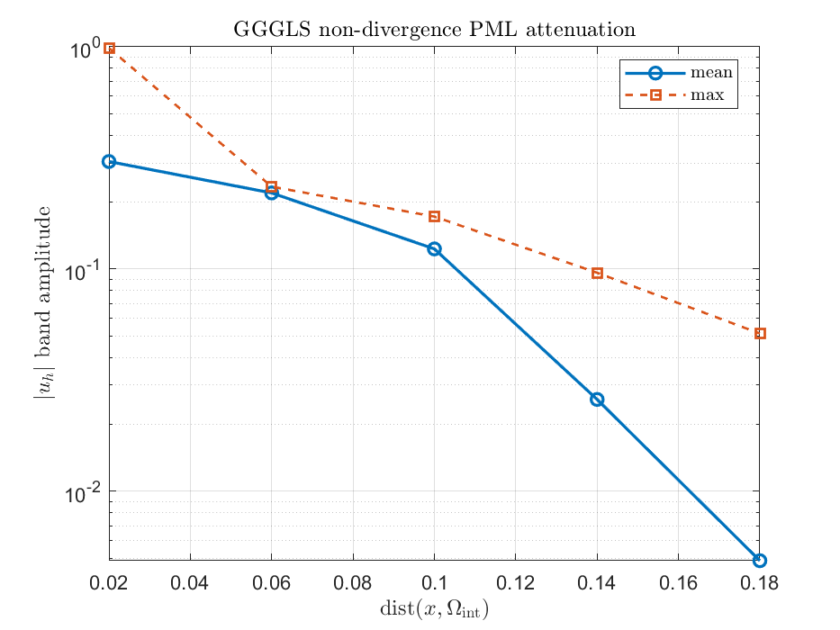
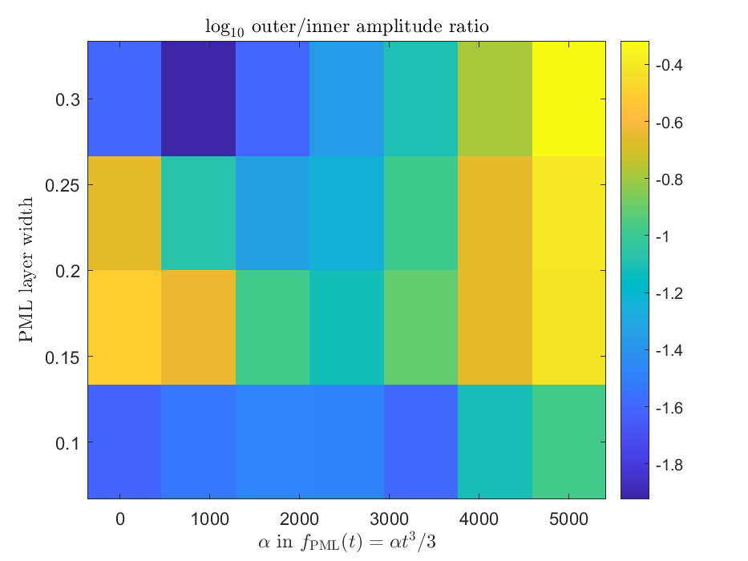
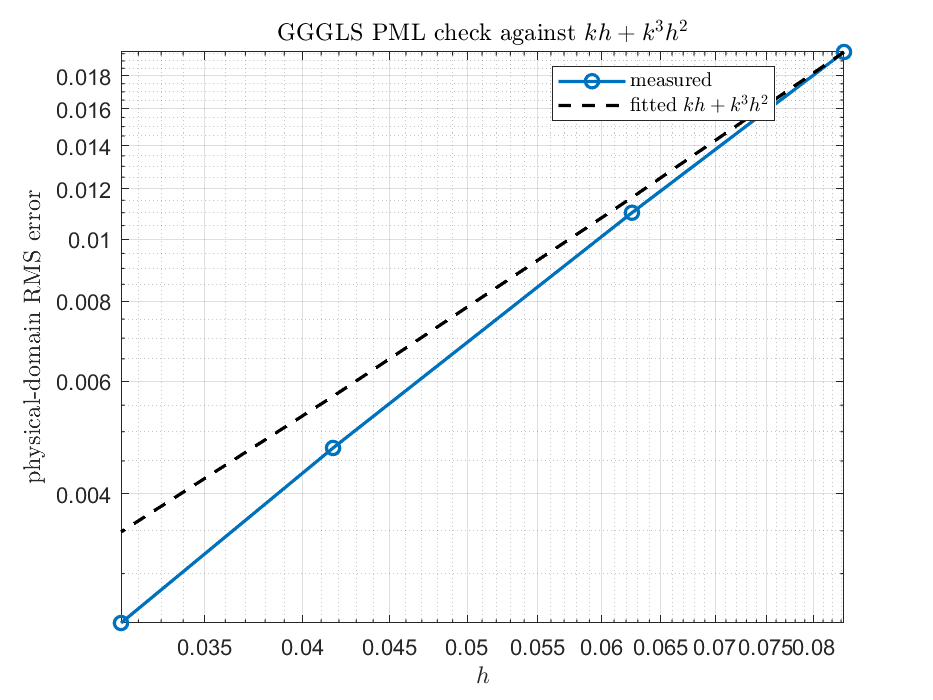

# GGGLS PML Decay And Preasymptotic Verification

This run repeats the earlier PML decay and P1 pre-asymptotic convergence checks using `assembleGGGLSPML2D`, i.e. the expanded non-divergence GGGLS operator with `f_PML(t)=alpha*t^3/3`.

## Decay By Band Center

Parameters: `k=20`, `h=0.04`, PML width `0.2`, `alpha=100`. Outer/inner mean-amplitude ratio: `2.213e-02`.

Band center is `(r_i+r_{i+1})/2` after splitting the PML distance interval `[0,width]` into equal bands, where `r=dist(x,Omega_int)`.

| band center | mean amplitude | max amplitude |
|---:|---:|---:|
| 0.02 | 3.0452e-01 | 9.8745e-01 |
| 0.06 | 2.1997e-01 | 2.3480e-01 |
| 0.1 | 1.2314e-01 | 1.7215e-01 |
| 0.14 | 2.5879e-02 | 9.6165e-02 |
| 0.18 | 4.8675e-03 | 5.1253e-02 |

## Width And Absorption Sweep

The complex absorbing strength is controlled by `alpha`; the maximum imaginary stretch over a layer of width `w` is `alpha*w^2`.

| width | alpha | max imag stretch | inner mean | outer mean | outer/inner | outer max | DOF |
|---:|---:|---:|---:|---:|---:|---:|---:|
| 0.1 | 50 | 0.5 | 3.9438e-01 | 9.6281e-03 | 2.4413e-02 | 2.8828e-01 | 529 |
| 0.1 | 100 | 1 | 3.3188e-01 | 9.6648e-03 | 2.9121e-02 | 2.6033e-01 | 529 |
| 0.1 | 250 | 2.5 | 2.5377e-01 | 8.4623e-03 | 3.3347e-02 | 2.0776e-01 | 529 |
| 0.1 | 500 | 5 | 2.2690e-01 | 7.4971e-03 | 3.3041e-02 | 1.7933e-01 | 529 |
| 0.1 | 1000 | 10 | 2.3286e-01 | 5.9035e-03 | 2.5352e-02 | 1.5684e-01 | 529 |
| 0.1 | 2500 | 25 | 3.9607e-01 | 3.0680e-02 | 7.7462e-02 | 8.7813e-01 | 529 |
| 0.1 | 5000 | 50 | 3.0694e-01 | 3.2424e-02 | 1.0564e-01 | 9.9469e-01 | 529 |
| 0.15 | 50 | 1.125 | 2.2422e-01 | 6.9828e-02 | 3.1142e-01 | 2.3018e-01 | 625 |
| 0.15 | 100 | 2.25 | 2.2188e-01 | 5.0865e-02 | 2.2924e-01 | 1.5387e-01 | 625 |
| 0.15 | 250 | 5.625 | 2.1573e-01 | 2.2865e-02 | 1.0599e-01 | 9.0930e-02 | 625 |
| 0.15 | 500 | 11.25 | 1.9786e-01 | 1.5120e-02 | 7.6417e-02 | 8.7896e-02 | 625 |
| 0.15 | 1000 | 22.5 | 1.8420e-01 | 2.2945e-02 | 1.2456e-01 | 1.2944e-01 | 625 |
| 0.15 | 2500 | 56.25 | 3.5611e-01 | 7.8417e-02 | 2.2021e-01 | 5.4031e-01 | 625 |
| 0.15 | 5000 | 112.5 | 2.9720e-01 | 1.1387e-01 | 3.8313e-01 | 6.8929e-01 | 625 |
| 0.2 | 50 | 2 | 2.1968e-01 | 4.8015e-02 | 2.1857e-01 | 1.5000e-01 | 729 |
| 0.2 | 100 | 4 | 2.1992e-01 | 1.8733e-02 | 8.5184e-02 | 1.0518e-01 | 729 |
| 0.2 | 250 | 10 | 2.0786e-01 | 9.5120e-03 | 4.5762e-02 | 5.7273e-02 | 729 |
| 0.2 | 500 | 20 | 1.8822e-01 | 1.0862e-02 | 5.7705e-02 | 4.3584e-02 | 729 |
| 0.2 | 1000 | 40 | 1.6959e-01 | 1.7812e-02 | 1.0503e-01 | 6.5067e-02 | 729 |
| 0.2 | 2500 | 100 | 3.6880e-01 | 8.1962e-02 | 2.2224e-01 | 3.3601e-01 | 729 |
| 0.2 | 5000 | 200 | 3.1210e-01 | 1.2402e-01 | 3.9736e-01 | 4.0594e-01 | 729 |
| 0.3 | 50 | 4.5 | 1.9899e-01 | 4.9596e-03 | 2.4924e-02 | 5.9586e-02 | 961 |
| 0.3 | 100 | 9 | 1.8358e-01 | 2.1857e-03 | 1.1906e-02 | 2.5056e-02 | 961 |
| 0.3 | 250 | 22.5 | 1.4827e-01 | 3.6455e-03 | 2.4587e-02 | 1.3323e-02 | 961 |
| 0.3 | 500 | 45 | 1.2465e-01 | 5.5247e-03 | 4.4322e-02 | 1.8487e-02 | 961 |
| 0.3 | 1000 | 90 | 1.0886e-01 | 8.6481e-03 | 7.9445e-02 | 3.6357e-02 | 961 |
| 0.3 | 2500 | 225 | 2.9225e-01 | 4.8466e-02 | 1.6584e-01 | 2.8014e-01 | 961 |
| 0.3 | 5000 | 450 | 3.6611e-01 | 1.7502e-01 | 4.7805e-01 | 5.8243e-01 | 961 |

## P1 Preasymptotic Convergence

Parameters: `k=8`, reference `h=0.01042`, PML width `0.25`, `alpha=100`. Model column is `kh+k^3h^2`; fitted max ratio is `4.646e-03`.

| h | kh | kh+k^3h^2 | RMS error | error/model |
|---:|---:|---:|---:|---:|
| 0.083333 | 0.66667 | 4.2222 | 1.9617e-02 | 4.6462e-03 |
| 0.0625 | 0.5 | 2.5 | 1.0998e-02 | 4.3994e-03 |
| 0.041667 | 0.33333 | 1.2222 | 4.7156e-03 | 3.8582e-03 |
| 0.03125 | 0.25 | 0.75 | 2.5110e-03 | 3.3480e-03 |
