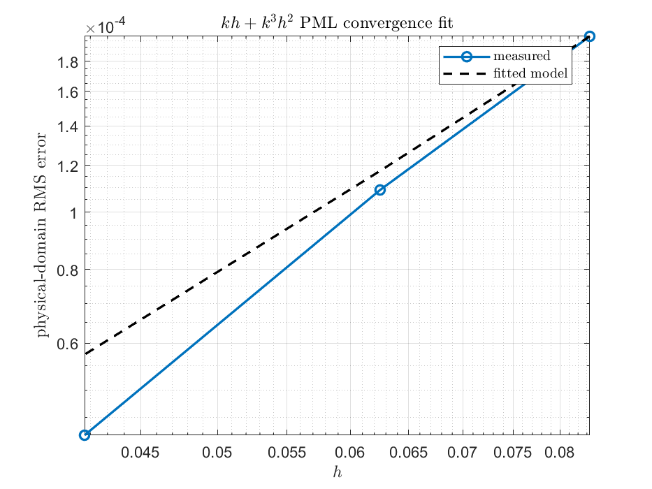
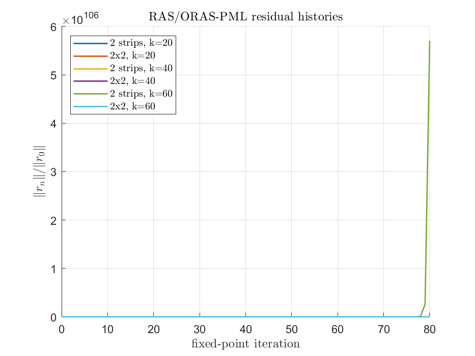
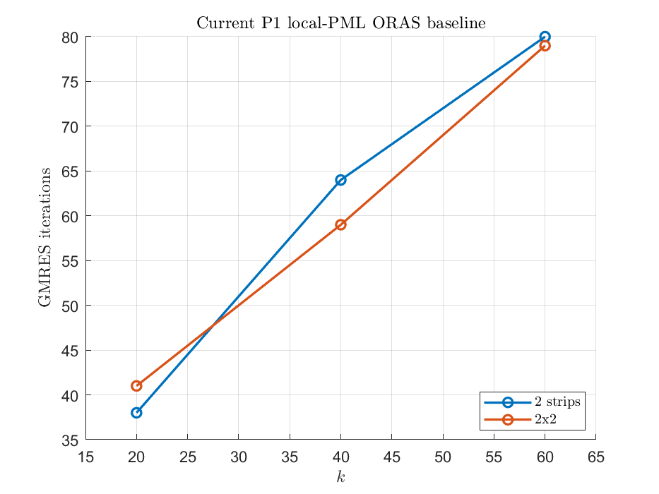
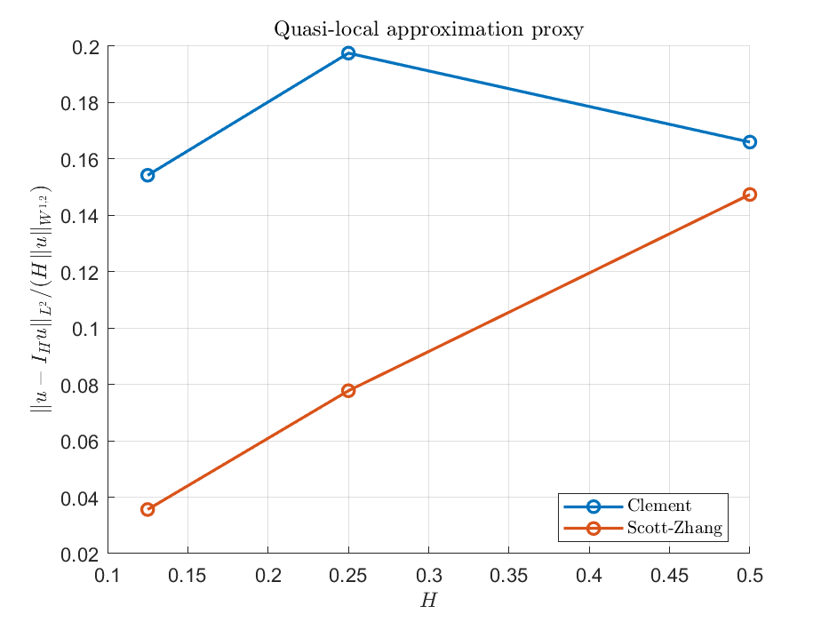

# Theory-Level Verification Results

Generated by `verify/verify_theory_new_functions.m`.

## PML Decay And Convergence

PML decay: `k=20`, `h=0.04`, layer width `0.2`, outer/inner mean-amplitude ratio `4.157e-02`.

Definition of band center: let `d(x)=dist(x,Omega_phys)` and split the PML layer `[0,width]` into radial-distance bands `[r_i,r_{i+1}]`. The reported band center is `(r_i+r_{i+1})/2`; the mean/max amplitudes are computed over mesh nodes whose distance `d(x)` lies in that band. Thus the table measures whether `|u_h|` decays as one moves outward through the PML layer.

| band center | mean amplitude | max amplitude |
|---:|---:|---:|
| 0.02 | 7.5895e-04 | 2.4547e-03 |
| 0.06 | 5.5111e-04 | 5.8158e-04 |
| 0.1 | 3.5285e-04 | 4.6224e-04 |
| 0.14 | 1.1007e-04 | 3.0098e-04 |
| 0.18 | 2.2909e-05 | 1.8334e-04 |

PML layer width and complex absorption sweep: `sigmaMax` is the peak value in `s_l=1+i*sigma_l/k`, so `sigmaMax/k` is the largest imaginary stretch in one coordinate direction. Smaller outer/inner ratios mean stronger attenuation from the inner third to the outer third of the layer.

| width | sigmaMax/k | sigmaMax | inner mean | outer mean | outer/inner | outer max | DOF |
|---:|---:|---:|---:|---:|---:|---:|---:|
| 0.1 | 1 | 20 | 8.2589e-04 | 2.3088e-05 | 2.7955e-02 | 6.0862e-04 | 529 |
| 0.1 | 2 | 40 | 6.6266e-04 | 2.1911e-05 | 3.3065e-02 | 5.1823e-04 | 529 |
| 0.1 | 3 | 60 | 6.1451e-04 | 2.0496e-05 | 3.3353e-02 | 4.6334e-04 | 529 |
| 0.1 | 4 | 80 | 6.0437e-04 | 1.8753e-05 | 3.1028e-02 | 4.2904e-04 | 529 |
| 0.15 | 1 | 20 | 5.6694e-04 | 1.8159e-04 | 3.2029e-01 | 6.3066e-04 | 625 |
| 0.15 | 2 | 40 | 5.5331e-04 | 1.3529e-04 | 2.4452e-01 | 4.0925e-04 | 625 |
| 0.15 | 3 | 60 | 5.5174e-04 | 1.0415e-04 | 1.8877e-01 | 3.3646e-04 | 625 |
| 0.15 | 4 | 80 | 5.4929e-04 | 7.9741e-05 | 1.4517e-01 | 2.7937e-04 | 625 |
| 0.2 | 1 | 20 | 5.2936e-04 | 2.0154e-04 | 3.8073e-01 | 6.1811e-04 | 729 |
| 0.2 | 2 | 40 | 5.4846e-04 | 1.2079e-04 | 2.2024e-01 | 3.8036e-04 | 729 |
| 0.2 | 3 | 60 | 5.4928e-04 | 7.4894e-05 | 1.3635e-01 | 3.0684e-04 | 729 |
| 0.2 | 4 | 80 | 5.4708e-04 | 4.6467e-05 | 8.4937e-02 | 2.5590e-04 | 729 |
| 0.3 | 1 | 20 | 5.3503e-04 | 1.4229e-04 | 2.6595e-01 | 3.8807e-04 | 961 |
| 0.3 | 2 | 40 | 5.2050e-04 | 6.2346e-05 | 1.1978e-01 | 2.8427e-04 | 961 |
| 0.3 | 3 | 60 | 5.1055e-04 | 3.0259e-05 | 5.9267e-02 | 2.1784e-04 | 961 |
| 0.3 | 4 | 80 | 5.0120e-04 | 1.6215e-05 | 3.2352e-02 | 1.6632e-04 | 961 |

PML convergence model: measured physical-domain RMS error compared with `kh+k^3h^2`; fitted max ratio `4.698e-05`.

| h | kh | kh+k^3h^2 | RMS error | error/model |
|---:|---:|---:|---:|---:|
| 0.083333 | 0.6667 | 4.2222e+00 | 1.9836e-04 | 4.6980e-05 |
| 0.0625 | 0.5 | 2.5000e+00 | 1.0903e-04 | 4.3612e-05 |
| 0.041667 | 0.3333 | 1.2222e+00 | 4.1940e-05 | 3.4315e-05 |

## ORAS-PML Iterations

Current implementation baseline is P1-only. Published RAS-PML/RMS-PML tables use P2 and therefore are comparison targets, not exact reproduction rows for these P1 runs.

| shape | k | h | DOF | Richardson | GMRES | relres | paper fixed-point range | paper GMRES range | status |
|---|---:|---:|---:|---:|---:|---:|---|---|---|
| 2 strips | 20 | 0.027778 | 1764 | >80 | 38 | 8.788e-07 | 3-4 | 3-4 | ok |
| 2x2 | 20 | 0.027778 | 1764 | >80 | 41 | 6.891e-07 | 6-9 | 6-7 | ok |
| 2 strips | 40 | 0.019608 | 3600 | >80 | 64 | 9.445e-07 | 3-4 | 3-4 | ok |
| 2x2 | 40 | 0.019608 | 3600 | >80 | 59 | 9.995e-07 | 6-9 | 6-7 | ok |
| 2 strips | 60 | 0.012987 | 8281 | >80 | 80 | 9.148e-06 | 3-4 | 3-4 | gmres-flag |
| 2x2 | 60 | 0.012987 | 8281 | >80 | 79 | 9.295e-07 | 6-9 | 6-7 | ok |

Paper target note: fixed-width and mesh-dependent delta counts from Galkowski-Gong-Graham-Lafontaine-Spence style tables are stored only as ranges here because this suite runs a moderate P1 analogue.

Mismatch diagnosis:

| item | diagnosis |
|---|---|
| P1 vs P2 | The current `orasPMLHelmholtz2D` path is P1-only; published tables use P2 elements, so exact iteration matching is not expected. |
| PML differential operator | GGGLS define `Delta_s=sum_l (1/(1+i g_l'(x_l)) d_{x_l})^2` and local `Delta_{s,j}` analogously. Expanding this gives both second-order and first-order terms. Our `assembleHelmholtzPML2D` instead assembles the divergence-form stretched-coordinate operator with `A_pml=diag(s2/s1,s1/s2)` and mass coefficient `b_pml=s1*s2`. These are both Cartesian PML ideas, but they are not the same finite-element bilinear form. |
| Local operator `P_s^j` | In GGGLS, `P_s^j=-k^{-2}Delta_{s,j}-c^{-2}` differs from the global `P_s` only in subdomain PML regions; the partition of unity is subordinate to regions avoiding `supp(P_s^j-P_s)`. Our `smoothPartitionOfUnity2D` is normalized nodally over extracted elements and can be nonzero in local PML regions, so the algebra behind their RAS-PML proof is not reproduced. |
| FE realization | GGGLS define local FE spaces as restrictions of the global mesh on mesh-aligned `Omega_j` and use the discrete local matrix `A_{h,j}` for `P_s^j`. Our current P1 path rebuilds the local PML operator on the extracted local mesh and then eliminates all local boundary nodes. For aligned P1 meshes this is close in spirit but still not the same `P_s^j` discretization in (1.3)-(1.4). |
| PML profile | The paper uses a smooth scaling function `f_s` that is eventually linear, and the numerical section states `f_PML(x)=a x^3/3` with `a=30k`. The repo uses `sigma=sigmaMax*(distance/thickness)^sigmaOrder` inside `s=1+i sigma/k`; matching the paper requires a separate profile and the `Delta_s` weak form. |
| Fixed-point RAS-PML residual growth | The residual growth in the figure is therefore plausible for this current preconditioned Richardson operator; it means our present P1/divergence-form local-PML operator is not reproducing the GGGLS RAS-PML contraction. It should not be interpreted as a contradiction of the paper. |
| k=60 strip row | GMRES stopped at the 80-iteration cap with residual above `1e-6`; this is recorded as a mismatch rather than treated as paper agreement. |
| Variable coefficient c | Variable `c^{-2}` paper rows are not implemented in this moderate suite. |

## Clement And Scott-Zhang Transfers

Approximation proxy uses `||u-I_Hu||_{L^p}/(H||u||_{W^{1,2}})` and a max local patch proxy.

Summary of maximum ratios over all displayed 2D rows:

| family | Clement max | Scott-Zhang max |
|---|---:|---:|
| approximation global ratio | 5.8175e-01 | 5.0539e-01 |
| approximation local ratio | 6.2774e-01 | 2.4713e-01 |
| sampled/full stability ratio | 1.0000e+00 | 1.1403e+00 |

| operator | H | p | global ratio | max local ratio |
|---|---:|---:|---:|---:|
| Clement | 0.5 | 1 | 1.3900e-01 | 2.1221e-01 |
| Clement | 0.5 | 2 | 1.6598e-01 | 2.1221e-01 |
| Clement | 0.5 | 4 | 2.0033e-01 | 2.1221e-01 |
| Clement | 0.5 | 8 | 2.3916e-01 | 2.1221e-01 |
| Clement | 0.5 | inf | 3.5588e-01 | 2.1221e-01 |
| Scott-Zhang | 0.5 | 1 | 1.0488e-01 | 2.4713e-01 |
| Scott-Zhang | 0.5 | 2 | 1.4740e-01 | 2.4713e-01 |
| Scott-Zhang | 0.5 | 4 | 2.1609e-01 | 2.4713e-01 |
| Scott-Zhang | 0.5 | 8 | 3.0415e-01 | 2.4713e-01 |
| Scott-Zhang | 0.5 | inf | 5.0539e-01 | 2.4713e-01 |
| Clement | 0.25 | 1 | 1.6257e-01 | 6.2774e-01 |
| Clement | 0.25 | 2 | 1.9754e-01 | 6.2774e-01 |
| Clement | 0.25 | 4 | 2.4715e-01 | 6.2774e-01 |
| Clement | 0.25 | 8 | 3.0694e-01 | 6.2774e-01 |
| Clement | 0.25 | inf | 4.9837e-01 | 6.2774e-01 |
| Scott-Zhang | 0.25 | 1 | 6.0601e-02 | 2.0821e-01 |
| Scott-Zhang | 0.25 | 2 | 7.7767e-02 | 2.0821e-01 |
| Scott-Zhang | 0.25 | 4 | 1.0526e-01 | 2.0821e-01 |
| Scott-Zhang | 0.25 | 8 | 1.5295e-01 | 2.0821e-01 |
| Scott-Zhang | 0.25 | inf | 2.8942e-01 | 2.0821e-01 |
| Clement | 0.125 | 1 | 1.2034e-01 | 5.4925e-01 |
| Clement | 0.125 | 2 | 1.5422e-01 | 5.4925e-01 |
| Clement | 0.125 | 4 | 2.1237e-01 | 5.4925e-01 |
| Clement | 0.125 | 8 | 3.0358e-01 | 5.4925e-01 |
| Clement | 0.125 | inf | 5.8175e-01 | 5.4925e-01 |
| Scott-Zhang | 0.125 | 1 | 2.8314e-02 | 1.7678e-01 |
| Scott-Zhang | 0.125 | 2 | 3.5631e-02 | 1.7678e-01 |
| Scott-Zhang | 0.125 | 4 | 4.6830e-02 | 1.7678e-01 |
| Scott-Zhang | 0.125 | 8 | 6.7819e-02 | 1.7678e-01 |
| Scott-Zhang | 0.125 | inf | 1.5205e-01 | 1.7678e-01 |

Sampled Sobolev stability ratios for 2D P1 transfers. Fractional `s` values are diagnostics based on quadrature/centroid samples.

| operator | H | s | p | ratio | sampled? |
|---|---:|---:|---:|---:|---|
| Clement | 0.5 | 0 | 1 | 1.0000e+00 | no |
| Clement | 0.5 | 0 | 2 | 8.2343e-01 | no |
| Clement | 0.5 | 0 | 4 | 7.0329e-01 | no |
| Clement | 0.5 | 0 | 8 | 6.3771e-01 | no |
| Clement | 0.5 | 0 | inf | 5.8549e-01 | no |
| Clement | 0.5 | 0.5 | 1 | 3.1674e-01 | yes |
| Clement | 0.5 | 0.5 | 2 | 3.6516e-01 | yes |
| Clement | 0.5 | 0.5 | 4 | 3.8653e-01 | yes |
| Clement | 0.5 | 0.5 | 8 | 3.9356e-01 | yes |
| Clement | 0.5 | 0.5 | inf | 3.5318e-01 | yes |
| Clement | 0.5 | 1 | 1 | 4.2910e-01 | no |
| Clement | 0.5 | 1 | 2 | 3.4213e-01 | no |
| Clement | 0.5 | 1 | 4 | 2.9330e-01 | no |
| Clement | 0.5 | 1 | 8 | 2.7257e-01 | no |
| Clement | 0.5 | 1 | inf | 2.5079e-01 | no |
| Clement | 0.5 | 1.25 | 1 | 2.1954e-01 | yes |
| Clement | 0.5 | 1.25 | 2 | 2.4488e-01 | yes |
| Clement | 0.5 | 1.25 | 4 | 2.5760e-01 | yes |
| Clement | 0.5 | 1.25 | 8 | 2.6945e-01 | yes |
| Clement | 0.5 | 1.25 | inf | 2.5889e-01 | yes |
| Scott-Zhang | 0.5 | 0 | 1 | 8.2488e-01 | no |
| Scott-Zhang | 0.5 | 0 | 2 | 9.1773e-01 | no |
| Scott-Zhang | 0.5 | 0 | 4 | 9.8206e-01 | no |
| Scott-Zhang | 0.5 | 0 | 8 | 1.0430e+00 | no |
| Scott-Zhang | 0.5 | 0 | inf | 1.0130e+00 | no |
| Scott-Zhang | 0.5 | 0.5 | 1 | 7.3492e-01 | yes |
| Scott-Zhang | 0.5 | 0.5 | 2 | 9.8994e-01 | yes |
| Scott-Zhang | 0.5 | 0.5 | 4 | 1.0941e+00 | yes |
| Scott-Zhang | 0.5 | 0.5 | 8 | 1.1263e+00 | yes |
| Scott-Zhang | 0.5 | 0.5 | inf | 9.9548e-01 | yes |
| Scott-Zhang | 0.5 | 1 | 1 | 9.5886e-01 | no |
| Scott-Zhang | 0.5 | 1 | 2 | 1.0365e+00 | no |
| Scott-Zhang | 0.5 | 1 | 4 | 1.0197e+00 | no |
| Scott-Zhang | 0.5 | 1 | 8 | 9.7104e-01 | no |
| Scott-Zhang | 0.5 | 1 | inf | 8.5219e-01 | no |
| Scott-Zhang | 0.5 | 1.25 | 1 | 9.2788e-01 | yes |
| Scott-Zhang | 0.5 | 1.25 | 2 | 1.0706e+00 | yes |
| Scott-Zhang | 0.5 | 1.25 | 4 | 1.0947e+00 | yes |
| Scott-Zhang | 0.5 | 1.25 | 8 | 1.0966e+00 | yes |
| Scott-Zhang | 0.5 | 1.25 | inf | 1.0456e+00 | yes |
| Clement | 0.25 | 0 | 1 | 1.0000e+00 | no |
| Clement | 0.25 | 0 | 2 | 8.9009e-01 | no |
| Clement | 0.25 | 0 | 4 | 8.2674e-01 | no |
| Clement | 0.25 | 0 | 8 | 8.0145e-01 | no |
| Clement | 0.25 | 0 | inf | 7.8535e-01 | no |
| Clement | 0.25 | 0.5 | 1 | 5.8049e-01 | yes |
| Clement | 0.25 | 0.5 | 2 | 6.3870e-01 | yes |
| Clement | 0.25 | 0.5 | 4 | 6.4359e-01 | yes |
| Clement | 0.25 | 0.5 | 8 | 6.3981e-01 | yes |
| Clement | 0.25 | 0.5 | inf | 6.0498e-01 | yes |
| Clement | 0.25 | 1 | 1 | 6.8055e-01 | no |
| Clement | 0.25 | 1 | 2 | 6.1859e-01 | no |
| Clement | 0.25 | 1 | 4 | 5.8031e-01 | no |
| Clement | 0.25 | 1 | 8 | 5.4820e-01 | no |
| Clement | 0.25 | 1 | inf | 4.8105e-01 | no |
| Clement | 0.25 | 1.25 | 1 | 5.1274e-01 | yes |
| Clement | 0.25 | 1.25 | 2 | 5.7826e-01 | yes |
| Clement | 0.25 | 1.25 | 4 | 6.0195e-01 | yes |
| Clement | 0.25 | 1.25 | 8 | 6.1818e-01 | yes |
| Clement | 0.25 | 1.25 | inf | 6.5024e-01 | yes |
| Scott-Zhang | 0.25 | 0 | 1 | 1.0062e+00 | no |
| Scott-Zhang | 0.25 | 0 | 2 | 1.0030e+00 | no |
| Scott-Zhang | 0.25 | 0 | 4 | 9.9542e-01 | no |
| Scott-Zhang | 0.25 | 0 | 8 | 9.8992e-01 | no |
| Scott-Zhang | 0.25 | 0 | inf | 9.8807e-01 | no |
| Scott-Zhang | 0.25 | 0.5 | 1 | 8.6746e-01 | yes |
| Scott-Zhang | 0.25 | 0.5 | 2 | 9.8685e-01 | yes |
| Scott-Zhang | 0.25 | 0.5 | 4 | 1.0145e+00 | yes |
| Scott-Zhang | 0.25 | 0.5 | 8 | 1.0240e+00 | yes |
| Scott-Zhang | 0.25 | 0.5 | inf | 1.0434e+00 | yes |
| Scott-Zhang | 0.25 | 1 | 1 | 1.0298e+00 | no |
| Scott-Zhang | 0.25 | 1 | 2 | 1.0519e+00 | no |
| Scott-Zhang | 0.25 | 1 | 4 | 1.0597e+00 | no |
| Scott-Zhang | 0.25 | 1 | 8 | 1.0491e+00 | no |
| Scott-Zhang | 0.25 | 1 | inf | 9.8924e-01 | no |
| Scott-Zhang | 0.25 | 1.25 | 1 | 9.4920e-01 | yes |
| Scott-Zhang | 0.25 | 1.25 | 2 | 1.0969e+00 | yes |
| Scott-Zhang | 0.25 | 1.25 | 4 | 1.1403e+00 | yes |
| Scott-Zhang | 0.25 | 1.25 | 8 | 1.1375e+00 | yes |
| Scott-Zhang | 0.25 | 1.25 | inf | 1.0303e+00 | yes |
| Clement | 0.125 | 0 | 1 | 1.0000e+00 | no |
| Clement | 0.125 | 0 | 2 | 9.5836e-01 | no |
| Clement | 0.125 | 0 | 4 | 9.4462e-01 | no |
| Clement | 0.125 | 0 | 8 | 9.4190e-01 | no |
| Clement | 0.125 | 0 | inf | 9.5059e-01 | no |
| Clement | 0.125 | 0.5 | 1 | 8.8501e-01 | yes |
| Clement | 0.125 | 0.5 | 2 | 8.7850e-01 | yes |
| Clement | 0.125 | 0.5 | 4 | 8.9866e-01 | yes |
| Clement | 0.125 | 0.5 | 8 | 8.9590e-01 | yes |
| Clement | 0.125 | 0.5 | inf | 7.4221e-01 | yes |
| Clement | 0.125 | 1 | 1 | 8.5134e-01 | no |
| Clement | 0.125 | 1 | 2 | 8.2496e-01 | no |
| Clement | 0.125 | 1 | 4 | 8.0242e-01 | no |
| Clement | 0.125 | 1 | 8 | 7.6757e-01 | no |
| Clement | 0.125 | 1 | inf | 7.0380e-01 | no |
| Clement | 0.125 | 1.25 | 1 | 8.3399e-01 | yes |
| Clement | 0.125 | 1.25 | 2 | 8.6142e-01 | yes |
| Clement | 0.125 | 1.25 | 4 | 8.5566e-01 | yes |
| Clement | 0.125 | 1.25 | 8 | 8.5440e-01 | yes |
| Clement | 0.125 | 1.25 | inf | 8.5644e-01 | yes |
| Scott-Zhang | 0.125 | 0 | 1 | 1.0050e+00 | no |
| Scott-Zhang | 0.125 | 0 | 2 | 1.0040e+00 | no |
| Scott-Zhang | 0.125 | 0 | 4 | 1.0031e+00 | no |
| Scott-Zhang | 0.125 | 0 | 8 | 1.0028e+00 | no |
| Scott-Zhang | 0.125 | 0 | inf | 1.0141e+00 | no |
| Scott-Zhang | 0.125 | 0.5 | 1 | 1.0287e+00 | yes |
| Scott-Zhang | 0.125 | 0.5 | 2 | 1.0121e+00 | yes |
| Scott-Zhang | 0.125 | 0.5 | 4 | 1.0249e+00 | yes |
| Scott-Zhang | 0.125 | 0.5 | 8 | 1.0273e+00 | yes |
| Scott-Zhang | 0.125 | 0.5 | inf | 9.4467e-01 | yes |
| Scott-Zhang | 0.125 | 1 | 1 | 1.0147e+00 | no |
| Scott-Zhang | 0.125 | 1 | 2 | 1.0179e+00 | no |
| Scott-Zhang | 0.125 | 1 | 4 | 1.0186e+00 | no |
| Scott-Zhang | 0.125 | 1 | 8 | 1.0131e+00 | no |
| Scott-Zhang | 0.125 | 1 | inf | 9.7329e-01 | no |
| Scott-Zhang | 0.125 | 1.25 | 1 | 1.0190e+00 | yes |
| Scott-Zhang | 0.125 | 1.25 | 2 | 1.0583e+00 | yes |
| Scott-Zhang | 0.125 | 1.25 | 4 | 1.0461e+00 | yes |
| Scott-Zhang | 0.125 | 1.25 | 8 | 1.0284e+00 | yes |
| Scott-Zhang | 0.125 | 1.25 | inf | 1.0069e+00 | yes |

3D pilot stability ratios:

| operator | s | p | ratio |
|---|---:|---:|---:|
| Clement | 0 | 2 | 7.6773e-01 |
| Clement | 0 | inf | 4.7601e-01 |
| Clement | 1 | 2 | 3.2410e-01 |
| Clement | 1 | inf | 2.2985e-01 |
| Scott-Zhang | 0 | 2 | 7.5477e-01 |
| Scott-Zhang | 0 | inf | 9.4954e-01 |
| Scott-Zhang | 1 | 2 | 9.4862e-01 |
| Scott-Zhang | 1 | inf | 9.7118e-01 |

## CIP-FEM P1-P3 Preasymptotic Scaling

Plane-wave impedance problem with `k=8`. Model column is `(kh)^p+k(kh)^{2p}`.

| degree | h | kh | model | FEM energy | CIP energy | FEM/model | CIP/model |
|---:|---:|---:|---:|---:|---:|---:|---:|
| 1 | 0.25 | 2 | 3.4000e+01 | 6.4807e+00 | 9.2866e+00 | 1.9061e-01 | 2.7314e-01 |
| 1 | 0.16667 | 1.333 | 1.5556e+01 | 4.1229e+00 | 5.7109e+00 | 2.6505e-01 | 3.6713e-01 |
| 1 | 0.125 | 1 | 9.0000e+00 | 2.9036e+00 | 3.9316e+00 | 3.2263e-01 | 4.3685e-01 |
| 2 | 0.25 | 2 | 1.3200e+02 | 1.3516e+00 | 2.9561e+00 | 1.0239e-02 | 2.2395e-02 |
| 2 | 0.16667 | 1.333 | 2.7062e+01 | 7.0805e-01 | 1.0225e+00 | 2.6164e-02 | 3.7784e-02 |
| 2 | 0.125 | 1 | 9.0000e+00 | 4.8698e-01 | 5.5940e-01 | 5.4109e-02 | 6.2156e-02 |
| 3 | 0.25 | 2 | 5.2000e+02 | 5.1977e-01 | 1.1202e+00 | 9.9957e-04 | 2.1542e-03 |
| 3 | 0.16667 | 1.333 | 4.7320e+01 | 3.5806e-01 | 4.0097e-01 | 7.5669e-03 | 8.4737e-03 |
| 3 | 0.125 | 1 | 9.0000e+00 | 2.8200e-01 | 2.8095e-01 | 3.1334e-02 | 3.1217e-02 |

## Figures

- `fig_pml_decay.png`
- `fig_pml_width_sigma_sweep.png`
- `fig_pml_convergence.png`
- `fig_oras_pml_residuals.png`
- `fig_oras_pml_iterations.png`
- `fig_transfer_approximation.png`
- `fig_transfer_stability.png`
- `fig_cip_preasymptotic.png`

## GGGLS Non-Divergence PML Addendum

The PML decay and P1 pre-asymptotic convergence checks were rerun using the new `assembleGGGLSPML2D` non-divergence assembly. See `../gggls_pml_theory/gggls_pml_decay_convergence_results.md`.

Summary: decay outer/inner mean-amplitude ratio `2.213e-02`; best width/alpha sweep ratio `1.191e-02`; max `error/(kh+k^3h^2)` ratio `4.646e-03`.

Figures:

- `../gggls_pml_theory/fig_gggls_pml_decay.png`
- `../gggls_pml_theory/fig_gggls_pml_width_alpha_sweep.png`
- `../gggls_pml_theory/fig_gggls_pml_convergence.png`
